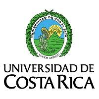

# Gabriela Rodríguez Arbustini

Estudiante de la Escuela de Geografía de la [Universidad de Costa Rica](https://www.ucr.ac.cr/).\
Carnet: C26529.\
Cursando el tercer año de carrera.

# Cursos matriculados.
* Geografía Histórica.
* Geomorfología.
* Análisis de datos geográficos.
* Procesamiento de datos geográficos.
* Geociencias.

